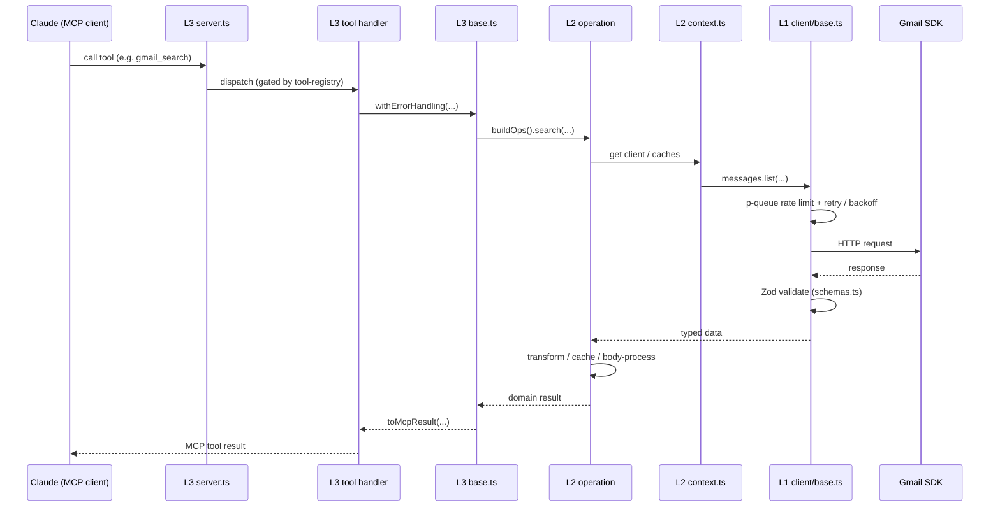
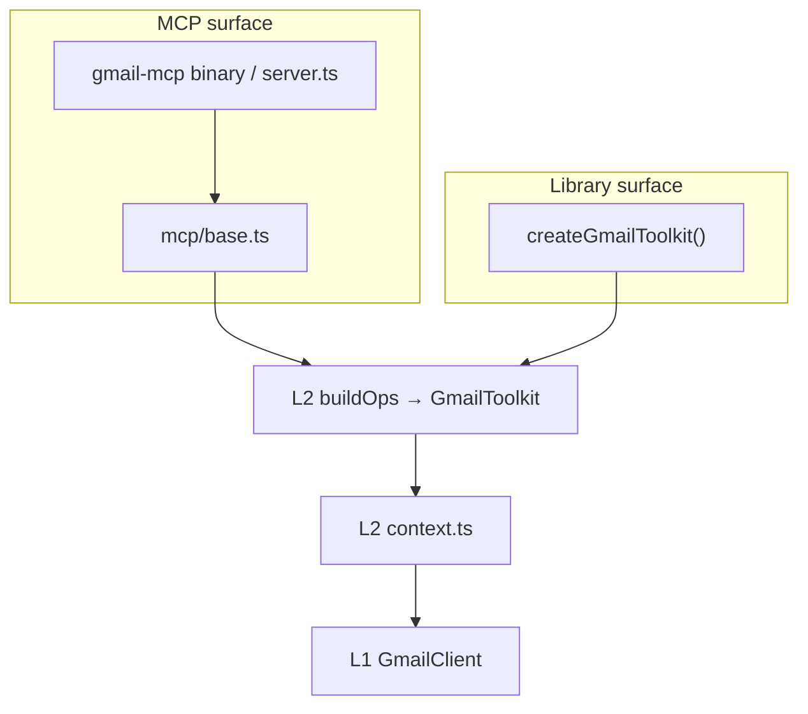
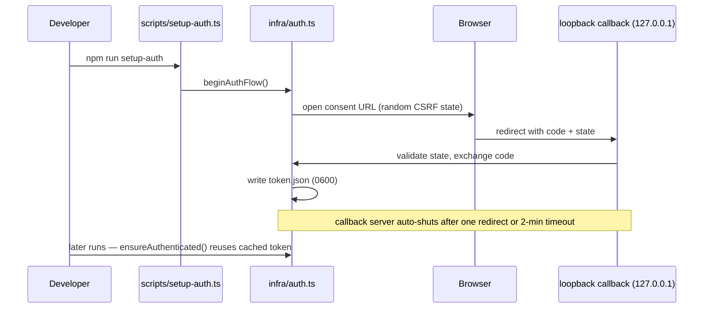

# Architecture

> How `dev-toolkit` is structured and **why**. For how to _work in_ the repo
> (setup, commands, conventions, adding a module), see
> [CONTRIBUTING.md](CONTRIBUTING.md). Throughout this document the linked
> config files are the source of truth for machine-enforced rules — the prose
> explains intent, not exhaustive specifics.

## Bird's-eye view

`dev-toolkit` is a multi-module TypeScript toolkit that wraps third-party SDKs
and exposes each integration through **two surfaces from a single codebase**:

- a **library namespace** — `import { gmail } from 'dev-toolkit'` — for
  programmatic use, and
- an **installable MCP server** — `gmail-mcp` — for LLM-driven use.

Both surfaces are thin shells over the same operations. The dual-surface
guarantee is that a program and an LLM reach _identical behavior_ because they
converge on the same layer (see [Control flow](#control-flow)).

Gmail is the **reference module**. Every module is built to the same four-layer
shape, so additional integrations replicate the pattern rather than inventing
new structure.

## The module model (toolkit-wide)

Each module is four layers. Imports only ever flow **downward**; any layer may
use L0.

| Layer           | Path                   | Responsibility                                                                   |
| --------------- | ---------------------- | -------------------------------------------------------------------------------- |
| **L0 — Infra**  | `src/<module>/infra/`  | Auth, logger, error classes, Zod schemas, shared types. Usable by any layer.     |
| **L1 — Client** | `src/<module>/client/` | 1:1 SDK facade: rate limiting, retries, timeouts, batching, validation.          |
| **L2 — API**    | `src/<module>/api/`    | Aggregated operations, caching, body processing, analytics. The behavioral core. |
| **L3 — MCP**    | `src/<module>/mcp/`    | Tools, resources, and prompts for LLM consumption.                               |

The diagram above is **auto-generated from the import graph** by
`dependency-cruiser` and re-checked on every push (`npm run docs:fresh`). It
shows _structure_ — who imports whom — and cannot drift from the code. The
[Control flow](#control-flow) section adds the _behavioral_ view the structural
graph cannot express.

## Invariants & boundaries

These rules are enforced by [`.dependency-cruiser.cjs`](.dependency-cruiser.cjs)
and validated by `npm run deps:check`. They exist for concrete reasons:

- **Downward-only imports (L3 → L2 → L1; any → L0).** Keeps each layer testable
  in isolation and prevents cyclic coupling.
- **Only [`api/context.ts`](src/gmail/api/context.ts) bridges L2 → L1.** Every other L2 file receives its
  L1 dependencies through `GmailContext`. _Why:_ a single, mockable seam between
  the behavioral layer and the SDK facade — the rest of L2 stays pure and
  unit-testable without touching the network.
- **Cross-layer access goes through barrels** (`index.ts`), never deep imports.
  _Why:_ the barrel is a layer's published surface; deep imports couple callers
  to internal file layout and defeat encapsulation.
- **[`src/index.ts`](src/index.ts) re-exports module barrels only** (`export * as gmail`).
  _Why:_ the toolkit root exposes namespaces, not module internals.

For exact patterns and severities, read the cruiser config — it is the
authority; this list is the rationale.

## Codemap

Where to look — directories and a few load-bearing files, not an exhaustive
listing:

- [`src/index.ts`](src/index.ts) — toolkit barrel; namespaces each module (`gmail`).
- [`src/gmail/index.ts`](src/gmail/index.ts) — module barrel; the library entry (`createGmailToolkit`).
- [`src/gmail/infra/`](src/gmail/infra/) — [`auth.ts`](src/gmail/infra/auth.ts) (OAuth), [`logger.ts`](src/gmail/infra/logger.ts) (the only file allowed `console.error`), [`errors.ts`](src/gmail/infra/errors.ts), [`data-cache.ts`](src/gmail/infra/data-cache.ts) (generic TTL cache), [`types.ts`](src/gmail/infra/types.ts) (Zod schemas + inferred types — the type hub).
- [`src/gmail/client/`](src/gmail/client/) — [`base.ts`](src/gmail/client/base.ts) (rate limiting via `p-queue`, retries, timeouts, batching), [`index.ts`](src/gmail/client/index.ts) (`GmailClient`, aggregating per-resource sub-clients), [`schemas.ts`](src/gmail/client/schemas.ts) (Zod response validation).
- [`src/gmail/api/`](src/gmail/api/) — **[`context.ts`](src/gmail/api/context.ts)** (the sole L2 → L1 bridge; holds the client, caches, and settings), [`index.ts`](src/gmail/api/index.ts) (`buildOps` → the `GmailToolkit`), operation modules ([`messages.ts`](src/gmail/api/messages.ts), [`drafts.ts`](src/gmail/api/drafts.ts), [`filters.ts`](src/gmail/api/filters.ts), [`labels.ts`](src/gmail/api/labels.ts), [`history.ts`](src/gmail/api/history.ts), [`account.ts`](src/gmail/api/account.ts)), and supporting [`helpers.ts`](src/gmail/api/helpers.ts) / [`body-processing.ts`](src/gmail/api/body-processing.ts) / [`transform.ts`](src/gmail/api/transform.ts).
- [`src/gmail/mcp/`](src/gmail/mcp/) — **[`server.ts`](src/gmail/mcp/server.ts)** (the `gmail-mcp` binary entry), [`base.ts`](src/gmail/mcp/base.ts) (where MCP meets L2, plus error wrapping), [`tool-registry.ts`](src/gmail/mcp/tool-registry.ts) (tool gating), `tools-{read,create,update,delete}.ts`, [`resources.ts`](src/gmail/mcp/resources.ts), [`prompts.ts`](src/gmail/mcp/prompts.ts).
- [`docs/`](docs/) — **generated, never hand-edited:** `typedoc/` (API docs, gitignored), [`dev-toolkit.api.md`](docs/dev-toolkit.api.md) (API Extractor report), [`architecture.svg`](docs/architecture.svg) / [`.mermaid`](docs/architecture.mermaid) (dependency-cruiser graph). Regenerate via `npm run docs` (see [CONTRIBUTING.md](CONTRIBUTING.md#documentation-maintenance)).

## Control flow

The generated diagram shows _structure_. These hand-authored sequences show
_behavior_ — the order things fire at runtime. They are drawn at the
**layer / component** altitude (not individual functions), so they change only
when the enforced boundaries above change — and `dependency-cruiser` flags that
half automatically.

### MCP tool request lifecycle

### Dual-surface convergence

Both surfaces converge on L2 `buildOps` — the structural reason library and MCP
behavior cannot diverge:

### OAuth bootstrap (one-time)

Security-relevant; the threat model lives in [SECURITY.md](SECURITY.md) — this
is only the flow.

## Gmail module — worked example

How Gmail fills the shape:

- **L1** wraps the `googleapis` Gmail SDK per resource (messages, threads,
  labels, drafts, filters, history, settings). [`base.ts`](src/gmail/client/base.ts) centralizes
  quota-aware batching, exponential backoff on `429` / `5xx`, and read/write
  timeouts.
- **L2** adds the value: enriched search summaries, read deduplication,
  label/filter caching (`*-cache.ts` over the generic `DataCache`), and body
  processing (`html-to-text`) that turns raw payloads into LLM-friendly text.
  [`context.ts`](src/gmail/api/context.ts) wires the client and caches together once.
- **L3** exposes operations as MCP tools grouped by category — read, write
  (compose/label/filter), and destructive — with **destructive tools disabled
  by default**. The canonical tool list, categories, and gating live in
  [`tool-registry.ts`](src/gmail/mcp/tool-registry.ts) (`DEFAULT_TOOL_REGISTRY`);
  enablement is configurable via `GMAIL_ENABLE_TOOLS` / `GMAIL_DISABLE_TOOLS`.
  Resources expose read-only views (`gmail://labels`, `gmail://filters`,
  `gmail://profile`); prompts package common inbox workflows.

## Design rationale

These are proto-ADRs. When [`docs/adrs/`](docs/adrs/) is seeded, they migrate there.

- **Why four layers?** Each layer has one job and one reason to change: SDK
  churn stops at L1, behavior lives in L2, LLM ergonomics live in L3,
  cross-cutting concerns in L0. The split is what lets a second module (GitHub,
  spec'd under [`docs/spec/`](docs/spec/)) reuse the L0–L3 contract instead of starting from
  scratch.
- **Why a single L2 → L1 bridge (`context.ts`)?** It keeps L2 pure and
  network-free in tests and gives exactly one place to inject a mock client.
- **Why generated docs?** The API report, typedoc, and architecture graph are
  derived from the code and re-checked in CI (`npm run docs:fresh`), so they
  cannot drift. Prose docs — this file and CONTRIBUTING — carry only what
  generation can't: intent, rationale, and runtime behavior.
- **Why All Rights Reserved?** This is a personal portfolio artifact, not a
  product — see [LICENSE](LICENSE) and [SECURITY.md](SECURITY.md).

## Adding a module (anatomy)

A module is `infra/` + `client/` + `api/` + `mcp/`, each with a barrel
`index.ts`, re-exported as a namespace from [`src/index.ts`](src/index.ts). The structural
contract is above; the **step-by-step procedure** lives in
[CONTRIBUTING.md](CONTRIBUTING.md#adding-a-new-module).
