# Dev Toolkit

A multi-module TypeScript developer toolkit for third-party SDK integrations with MCP (Model Context Protocol) server exposure. Each module ships as both a library namespace and an installable MCP server, so the same code powers both programmatic use and LLM-driven workflows.

**Status:** Gmail is the first module. The module structure is built so additional Google API integrations can follow the same shape.

---

## Modules

| Module | Library namespace           | MCP binary  | Description                                                                |
| ------ | --------------------------- | ----------- | -------------------------------------------------------------------------- |
| Gmail  | `import { gmail } from ...` | `gmail-mcp` | Search, read, label, draft, filter, and history with quota-aware batching. |

---

## Architecture

Each module follows the same four-layer shape — **L0 Infra**, **L1 Client**, **L2 API**, **L3 MCP** — with imports flowing strictly downward, enforced by `dependency-cruiser`. The diagram below is auto-generated from the import graph, so it cannot drift from the code.



See [ARCHITECTURE.md](ARCHITECTURE.md) for the layer responsibilities, invariants, control-flow diagrams, and design rationale, and [docs/dev-toolkit.api.md](docs/dev-toolkit.api.md) for the public API report.

---

## Getting Started

### Prerequisites

- **Node.js 20+** (per `engines.node` in [`package.json`](package.json)).
- **Google OAuth credentials** for the Gmail API:
  1. In [Google Cloud Console](https://console.cloud.google.com/), create or select a project.
  2. Enable the **Gmail API**.
  3. Create an **OAuth 2.0 Client ID** (Desktop application).
  4. Download the credentials JSON and save it as `./credentials.json` at the repo root (or set `GMAIL_CREDENTIALS_PATH` to its absolute path).
- **One-time auth**: run `npm run setup-auth` to complete the interactive OAuth flow. This produces `./token.json` (or wherever `GMAIL_TOKEN_PATH` points). The MCP server cannot do interactive OAuth from inside Claude Desktop, so this step is required before configuring the MCP server.
- **Optional config**: copy [`.env.example`](.env.example) to `.env` for the full list of supported environment variables (credential/token paths, OAuth callback port, log level, tool gating) — all optional with sensible defaults.

### Library usage

```ts
import { gmail } from 'dev-toolkit';

const toolkit = await gmail.createGmailToolkit();
const results = await toolkit.search('is:unread from:chase');
```

Auth resolves from `GMAIL_CREDENTIALS_PATH` and `GMAIL_TOKEN_PATH` env vars or `./credentials.json` / `./token.json` defaults. First-use OAuth is interactive; subsequent runs use the cached token.

### MCP server usage

First, build and install the `gmail-mcp` binary onto your PATH (until the package is published to npm):

```bash
npm install
npm run build
npm install -g .   # registers the gmail-mcp binary globally
```

Then add the Gmail MCP server to your `claude_desktop_config.json`:

```json
{
  "mcpServers": {
    "gmail": {
      "command": "gmail-mcp",
      "env": {
        "GMAIL_CREDENTIALS_PATH": "/absolute/path/to/credentials.json",
        "GMAIL_TOKEN_PATH": "/absolute/path/to/token.json"
      }
    }
  }
}
```

If you'd rather skip the global install, swap the `command` for an absolute node invocation: `"command": "node", "args": ["/absolute/path/to/dev-toolkit/dist/gmail/mcp/server.js"]`.

The Gmail MCP server exposes read, write, and destructive tools (destructive disabled by default), three resources (`gmail://labels`, `gmail://filters`, `gmail://profile`), and a set of inbox-workflow prompts. The canonical tool list and gating live in [`tool-registry.ts`](src/gmail/mcp/tool-registry.ts); enablement is configurable via `GMAIL_ENABLE_TOOLS` and `GMAIL_DISABLE_TOOLS` env vars.

---

## Development

For the codebase structure and design rationale, see [ARCHITECTURE.md](ARCHITECTURE.md); for setup, conventions, testing, and the daily command workflow, see [CONTRIBUTING.md](CONTRIBUTING.md).
